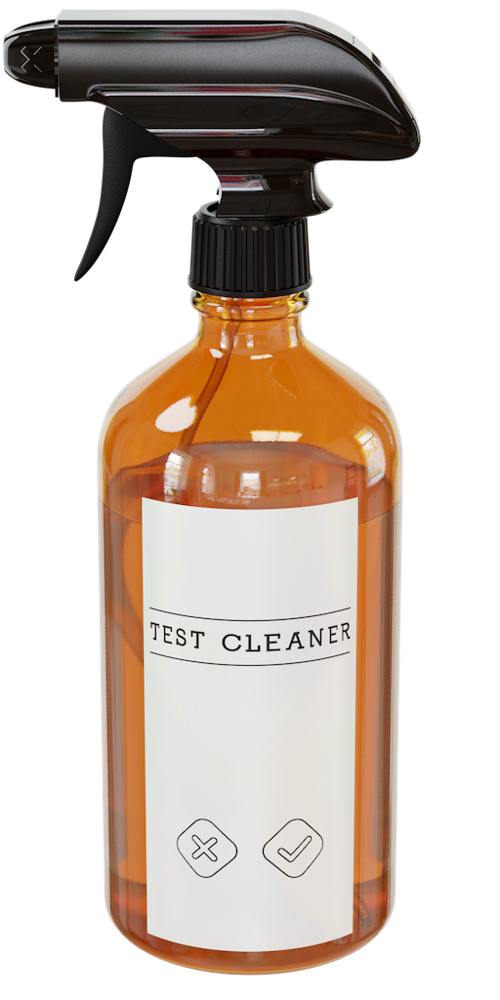

# TestCleaner



Here is an existing XCTest that confirms that a `Version` type’s `ExpressibleByStringLiteral` is working by comparing the results to known good values:

```swift
// Before
func testExpressibleByStringLiteral() {
  XCTAssertEqual("1", Version(major: 1)),
  XCTAssertEqual("1.0", Version(major: 1)),
  XCTAssertEqual("1.0.0", Version(major: 1)),
  XCTAssertEqual("1.2", Version(major: 1, minor: 2)),
  XCTAssertEqual("4.5.6", Version(major: 4, minor: 5, bugfix: 6)),
  XCTAssertEqual("10.1.88", Version(major: 10, minor: 1, bugfix: 88)),
}
```

Using TestCleaner, we can clean this up a little without sacrificing Xcode’s ability to highlight lines containing failing tests. We also recommend using a local `typealias` to help reduce line noise:

```swift
// After
func testExpressibleByStringLiteral() {
  typealias V = Version
  assertEqual(testCases: [
    Pair("1", V(major: 1)),
    Pair("1.0", V(major: 1)),
    Pair("1.0.0", V(major: 1)),
    Pair("1.2", V(major: 1, minor: 2)),
    Pair("4.5.6", V(major: 4, minor: 5, bugfix: 6)),
    Pair("10.1.88", V(major: 10, minor: 1, bugfix: 88)),
  ])
}
```

Now, the assert operation (“equal”) needs to be written in just one place, making the block of tests less error-prone and the intent clearer. It also reduces line length, although the `typealias` is helping there.

## Focus or Skip Tests

Borrowing syntax from [Quick](https://github.com/Quick/Quick), you can focus any tests by adding an `f` to the beginning, and only those tests will execute on the next run, allowing you to debug individual cases without having to haphazardly comment and uncomment lines:

```swift
func testExpressibleByStringLiteral() {
  typealias V = Version
  assertEqual(testCases: [
    Pair("1", V(major: 1)),
    fPair("1.0", V(major: 1)), // Only this test will run.
    Pair("1.0.0", V(major: 1)),
  ]
}
```

You can also skip test cases by prepending them with `x`:

```swift
func testExpressibleByStringLiteral() {
  typealias V = Version
  assertEqual(testCases: [
    Pair("1", V(major: 1)),
    xPair("1.0", V(major: 1)), // These last two tests will be ignored.
    xPair("1.0.0", V(major: 1)),
  ]
}
```

These can be combined in a single test for added flexibility: use `xPair` to skip some tests to start with, then focus in on just one to debug it with `fPair`.

## All Available Comparators

TestCleaner mirrors the full range of XCTAssert functions available:

- Boolean (true/false)
- LessThan `<`
- GreaterThan `>`
- LessThanOrEqual `<=`
- GreaterThanOrEqual `>=`
- Equal `==`
- Equal (with floating-point accuracy) `==`
- NotEqual `!=`
- NotEqual (with floating-point accuracy) `!=`

## Custom Assertions

If you have a custom assertion function, you can use the `assertCustom` function to use it with TestCleaner. Just make sure your custom assertion takes `file: StaticString, line: UInt` parameters, and forward the ones that the `tests` closure in `assertCustom` passes to you.

```swift
assertCustom(
  testCases: [
    Pair(someLeftValue, someRightValue),
    Pair(anotherLeftValue, anotherRightValue),
  ],
  tests: { pair, file, line in
    myCustomAssertion(
      pair.left, pair.right,
      message: pair.message,
      file: file, line: line // <-- ⚠️ this is important!
    )
    try youCanAlsoThrowErrorsInHere() // They will also get attributed to the correct line.
  }
)
```

## When To Use TestCleaner

This tool is ideal for tests of pure transformations, where a certain input will always produce the same output. Examples include: parsing, mapping, converting, and calculating. It is not intended to be used for integration-style tests, where each assertion is preceded by many lines of setup.

## Further Reading

TestCleaner was inspired by a [blog post](https://www.rightpoint.com/rplabs/2019/03/xctest-line-by-line/) which was in turn inspired by a conversation with [Brian King](https://twitter.com/kingofbrian).

The spray bottle image was made using Blender, and the project file is hosted at [ZevEisenberg/TestCleanerIcon](https://github.com/ZevEisenberg/TestCleanerIcon.git).
